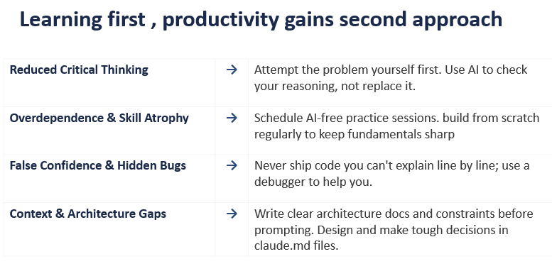

## Mental Models and Principles
- First Principles Thinking: Breaking complex problems down to their most basic, fundamental truths to rebuild innovative solutions. Asking why iteratively.
- Inversion: Thinking about a problem in reverse. Instead of asking how to succeed, ask, "How could this system fail?" or "What could go wrong?" to identify risks early.
- Second-Order Thinking: Considering the consequences of consequences. It involves looking beyond the immediate impact of a technical decision (e.g., adding a cache) to understand long-term effects (e.g., cache invalidation issues).
- Systems Thinking: Viewing software as a complex, interconnected system rather than isolated parts, understanding how components affect each other.
- Pareto Principle (80/20 Rule): Identifying the 20% of code that provides 80% of the value or causes 80% of the bugs, allowing for prioritized effort.
- Occam's Razor: Choosing the simplest solution with the fewest assumptions when faced with multiple design choices. 

## Process and Decision Frameworks
- Model-Based Systems Engineering (MBSE): Uses visual models rather than long written documents to manage complex systems, often utilizing languages like SysML. (Matlab Simulink)
- Failure Modes and Effects Analysis (FMEA): A step-by-step method to figure out what could go wrong, its severity, and its likelihood, used for robust design in critical systems.
- Type 1 vs. Type 2 Decisions (One-Way/Two-Way Doors): Classifying decisions based on reversibility. Irreversible (Type 1) decisions require deep thought, while reversible (Type 2) decisions favor speed

## Common pitfalls when starting a large project
- Not following a MVP and iterative structure for testing of ideas
- Trying to achive perfection in the first run
- Do not try to start new projects and stick to working on the core idea itself
- Track using a artifical ticketing system of tasks that are completed
- Structure high level reln before implementation with actual code, but do not obsess over it.
- Set artificial deadlines

## Best practices
### Structuing header and cpp files 
- Follow normal subdir config as standardised online (Ex: src, build, include)
- The hpp file associated with each cpp file (module) must only contain forward declerations of functions being used. 
- Seperate out all constants into different header files:
    - Config 
        1. Changing how each module runs -> Tuning
        2. Changing hardware derived constants -> Hardware config
    - Constants
        1. Global physics constants
    - Types 
        1. Shared types alises that are used inter-modules

### The correct way to handle errors
  - Scen 1 (main/Validation Layer): 
    1. User input invalid → log + exit non-zero, no exception.
    2. User input valid but unlikely -> log warning + proceed
  - Scen 2 (module functions): 
    1. Inter-module API misuse → throw typed exception.
    2. Programmer error caught at runtime → throw typed exception.
    3. Intra-module precondition violation -> assert
    4. Soft failure (Intra/Inter module) -> log + optional continue + optional bool
    5. Soft failure during iteration (Intra Module) -> log warning, proceed
 

#### Spdlog Different Error Levels:
- info (spdlog::level::info): General operational messages, highlighting progress (e.g., "Server started").
- warn (spdlog::level::warn): Indicates potentially harmful situations or unexpected events that are not immediate errors.
- error (spdlog::level::error): Used for errors that might allow the application to continue running, such as failed file reads or handled exceptions.
- critical (spdlog::level::critical): Severe errors causing premature application termination or major functionality failure.

### Naming Conventions
- Abbreviations should be obvious, if not capitalise. RPG (Role Playing Game)
- file_names, variable_names, Class/Struct member names --> Typed in snake_case (No - capitalisation)
- function_names --> PascalCase(No Capitalisation)
- Classes, Namespaces --> PascalCase(Capitalisation)
- Constants (Global, namespaced scoped, enum, class static) --> PascalCase (Prefixed with lowercase 'k')

### Others
1. Use scoped enums for switches instead of bool vals (no semantic meaning);
2. Use consistenly formatted namespaces for each module
4. Global helpers module should contain functions that are really global --> Does opencv or other third party libs not have this helper function that you have to implement yourself?
5. In terms of naming conventions --> The larger the scope, the more distinct and readable the names for objects, rvalues has to be.
6. Import std libs or third party libs in the .cpp file (the implementation file) or the header file only when used in the file itself.
7. Do not outsource parsing of code (understanding syntax), understanding (mental compilation) and writing code (making design decisions) to claude. You are outsourcing the skill people are going to hire you for.
8. Always do validation with false break/return cases instead of nested true cases. --> General Coding Antipattern

## Common errors
1. All relative paths used are relative to the root of the build dir as there is where the bin file is built.

## Specific guidelines for this project
- Make sure to upload into git after each iteration.
- Make sure to use claude CLI with claude getting updated context to MVP.md to answer specifically to context. 
- cv::Mat optimises copies by only copying headers of the matrix instead of entire matrix --> works like a shared pointer
    - Header (stack): rows, cols, type, step, and a uchar* data pointer                                      
    - Data (heap): the actual pixel buffer, with a int* refcount alongside it 

1. Take in cv::Mat by ref --> To prevent unnecessary copy of header during param initialization
    Use const if you are not modifying the image directly, but instead creating a copy
2. Return cv::Mat directly --> Return value optimsed, anyways shallow header copy, dont use out_params unless another value has to be returned also.